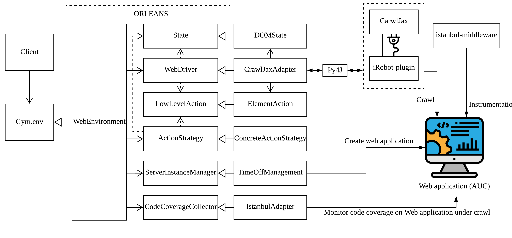
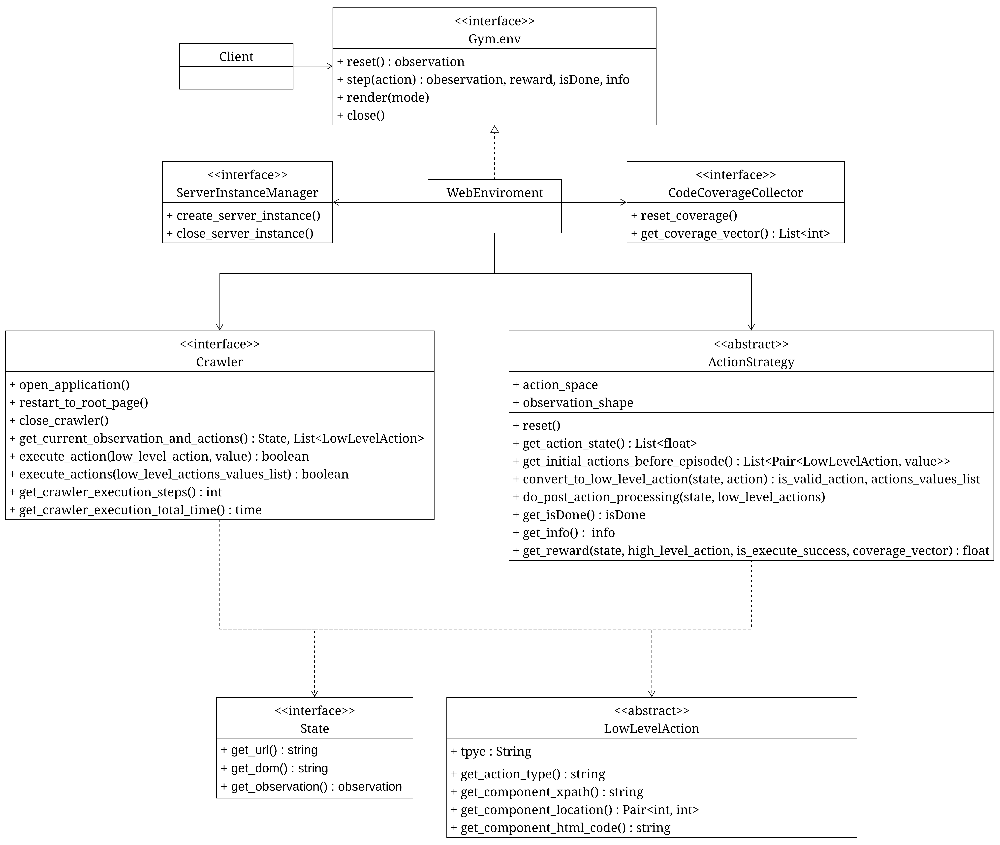

# ORLEANS
- This is a reinforcement learning environment which is for web application.
- ORLEANS can:
    - Easy to change the `Webdriver`
    - Easy to change the `Web Application`
    - Easy to change the `State Definition`
    - Easy to change the `Action Definition`
    - Easy to change the `Action Strategy Definition`
    - Easy to change the `Code Coverage Collector tool`

## System Architecture
  
  
## Class Diagram

## Run the Example
- Dependency:
    - Java 1.8.0
    - Python3 
    - tensorflow
    - gym
    - py4j
    - stable-baselines
    - docker
    - docker-compose
- Step:
    1. Install dependency
    2. run the command `python3 main.py`
    3. Then you can see the training process which using the DQN algorithm provided by [Stable-baselines](https://stable-baselines.readthedocs.io/en/master/index.html)

## How to use ORLEANS
1. Implement each interface
2. Using `Constructor Injection` to inject your implementation to WebEnvironment
3. Select your training algorithm(You can see [here](https://stable-baselines.readthedocs.io/en/master/guide/quickstart.html) to know how to change algorithm)
4. Done

